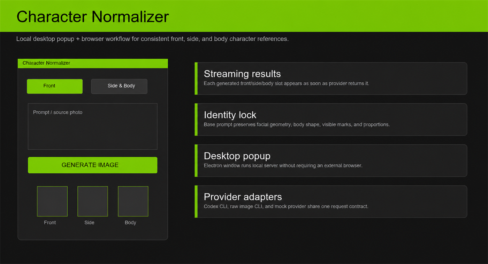
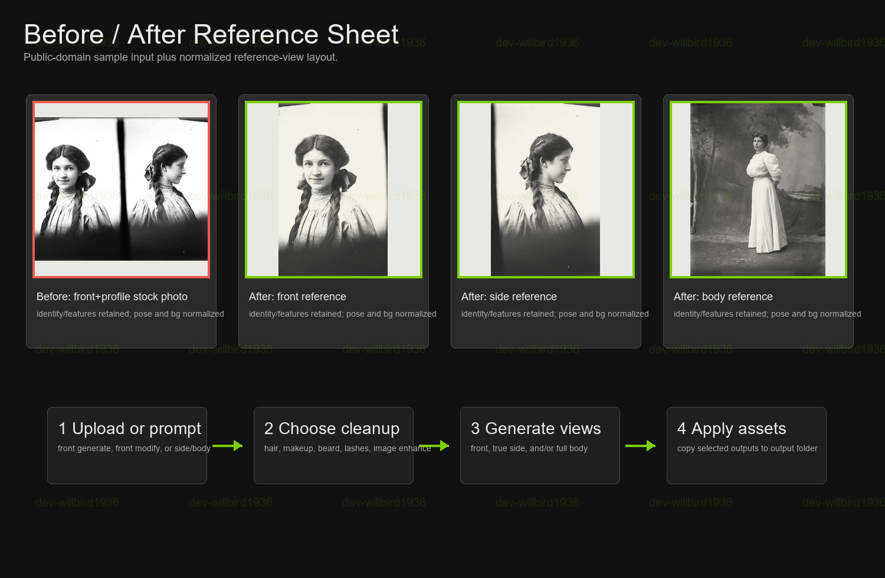
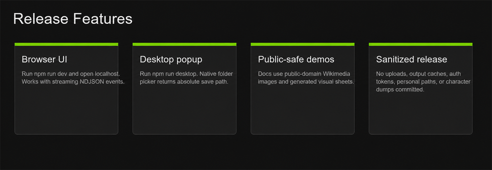

# Character Normalizer

[](https://github.com/dev-willbird1936/Character-Normalizer/actions/workflows/ci.yml)
[](https://github.com/dev-willbird1936/Character-Normalizer/releases/latest)
[](LICENSE)



Local Electron and browser app that generates consistent front, side, and full-body character reference images. It streams each result as soon as it is ready and applies strong identity-preservation rules across views.

## Reference Sheet Flow



Start with a source photo, then generate normalized front, true-side, and full-body references while preserving facial geometry, visible marks, clothing, build, and proportions.

The demo uses a Pexels stock photo. Source metadata is listed in [`docs/assets/STOCK_SOURCES.json`](docs/assets/STOCK_SOURCES.json).

## Quick Start

Requirements:

- Node.js 20 or later
- Codex CLI installed and authenticated for the default `codex-cli` provider

On Windows, run:

```bat
start-desktop.bat
```

Or run it directly:

```bash
npm install
npm run desktop
```

The Electron app starts a local server on a random loopback port and provides a native output-folder picker.

## Features



- Electron desktop popup and local browser modes
- Front prompt generation
- Front-photo modification with cleanup controls
- Side and full-body generation from source photos
- Streaming results for each generated asset
- Identity-preservation rules for face, marks, body shape, and proportions
- Provider adapters for Codex CLI, a raw image CLI, and mock output

## Browser Mode

Start the development server:

```bash
npm run dev
```

Open `http://localhost:3000`.

For a non-watch server:

```bash
npm start
```

Windows users can run `start.bat` to install missing dependencies, find Codex CLI, start the server, and open the browser.

## Mock Mode

Use mock mode to test the complete UI without making image-generation calls:

```bat
start-mock.bat
```

Or set the provider manually:

```powershell
$env:IMAGE_GENERATION_PROVIDER = "mock"
npm run dev
```

## Provider Configuration

The default provider is `codex-cli`. It runs Codex CLI once per requested output and asks `$imagegen` to save the final image and JSON asset metadata.

| Variable | Purpose |
| --- | --- |
| `IMAGE_GENERATION_PROVIDER` | Provider ID: `codex-cli`, `raw-image-cli`, or `mock`. |
| `CODEX_CLI_COMMAND` | Codex CLI path. Defaults to `codex` from `PATH`. |
| `CODEX_PROVIDER_ISOLATED_HOME` | Optional isolated Codex home. Set `0` to disable isolation. |
| `IMAGE_GEN_SCRIPT` | Optional script path for `raw-image-cli`. |
| `IMAGE_GEN_PYTHON` | Python executable for `raw-image-cli`. |
| `OPENAI_API_KEY` | Required only by `raw-image-cli`. |

Secrets are redacted from provider logs. Keep real keys in local environment variables and never commit them.

## Identity Preservation

For source-image modes, the base prompt preserves:

- original person and facial geometry
- eye shape, nose, mouth, jawline, cheekbones, and ears
- skin tone, visible marks, asymmetry, age impression, and expression
- body shape, build, and height-to-width proportions
- shoulder width, waist and hip balance, neck length, limb proportions, and posture cues

The prompt blocks unrequested beautification, age shifting, stylization, slimming, bulking, or generic identity replacement.

## Development

```bash
npm run build
npm test
```

Project layout:

- `public/`: browser UI
- `desktop/`: Electron shell and native folder picker bridge
- `src/server.ts`: Express app and generation endpoints
- `src/generation/`: provider interface, registry, prompt builder, and adapters
- `tests/`: provider, prompt, and server endpoint coverage

## Public Release Hygiene

The repository excludes local uploads, generated output, secrets, authentication caches, logs, and personal paths. Before publishing:

```bash
rg -n -i "token|secret|api[_-]?key|absolute-private-path|private-character-name|uploads|output" -g "!node_modules" -g "!package-lock.json"
npm run build
npm test
```

Expected matches must be documentation, tests with fake values, or redaction code.
